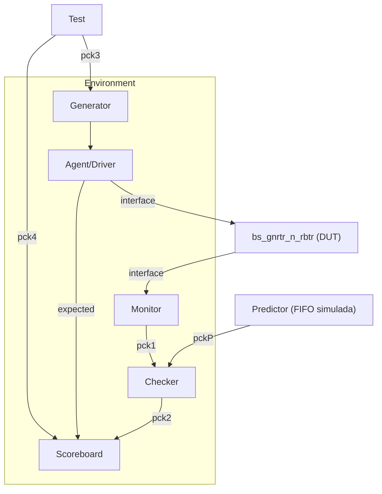

# Guía para el Avance 1 (Test Plan) — Proyecto 1

Es el proceso para que lo construyan ustedes, viendo directamente `fifo.sv` y `Library.sv`. Cada paso trae la pregunta que tienen que contestar.

---

## 0. Qué se pide (5%)

> "Test plan de todas las capacidades del diseño y diagramas mostrando los módulos, interfaces de comunicación entre módulos y formato de los paquetes de comunicación."

Tres cosas, ni más ni menos:
1. **Capacidades del diseño** → qué hace el DUT, en una lista.
2. **Diagramas** → módulos + cómo se conectan.
3. **Formato de paquete** → qué significan los bits que viajan por el bus.

---

## 1. Identifiquen el DUT correcto

El DUT corresponde al módulo bs_gnrtr_n_rbtr de Library.sv. Su nombre, sus parámetros (bits, drvrs, pckg_sz, broadcast) y la declaración de sus puertos como arreglos 2D coinciden exactamente con el prototipo mostrado en la diapositiva

---

## 2. Listen las capacidades del codigo.

| Bloque | Función | Qué se prueba |
|---|---|---|
| `bs_gnrtr_n_rbtr` (top) | Replica `bits` buses independientes, cada uno con `drvrs` terminales | Que cada instancia de bus opera de forma aislada de las demás (si `bits>1`) |
| `bs_ntrfs_n_rbtr` (x drvrs) | Interfaz completa de un terminal: serializa, controla, arbitra su turno | Un terminal puede transmitir y recibir de forma independiente |
| `serializer` (srlzr_wt) | Convierte `D_pop` (paralelo) a bit serial hacia el bus | El dato paralelo se transmite bit a bit sin pérdida ni corrupción |
| `serializer` (srlzr_rd) | Convierte el bit serial del bus a `D_push` (paralelo) | El dato recibido se reconstruye igual a como se transmitió |
| `ntrfs_cntrl_n_rbtr` | Cerebro del terminal: decide cuándo leer, cuándo escribir, compara dirección | Orquesta correctamente el ciclo completo de una transacción |
| `Write_st_Mchn` | Máquina de estados de transmisión | Un terminal con `pndng=1` solicita el bus, transmite, y libera el turno al terminar |
| `Read_st_Mchn` | Máquina de estados de recepción | Un terminal desplaza el paquete entrante completo y decide si lo captura (`push`) según dirección |
| `Counter` (count_w, count_r) | Cuenta bits desplazados dentro de una transacción | El conteo llega exactamente a `pckg_sz` sin desfase, marcando fin de paquete |
| `Counter_arb` (uno por terminal) | Contador de turno round-robin distribuido | Los `drvrs` terminales rotan el turno en orden `0,1,2,...,drvrs-1,0,...` |
| `Arbiter_st_Mchn` | Decide cuándo pasar el turno (`trn_chng`) | El turno avanza solo cuando el terminal actual ya no tiene nada que transmitir |
| `tri_buf` (bus, `trn_chng`, `bs_bsy`) | Aislamiento eléctrico de las líneas compartidas | Solo el terminal con `bs_grnt` maneja cada línea; los demás quedan en alta impedancia |
| Sistema completo | Dirección de destino (8 bits altos de `D_in`) | Un paquete es capturado solo por el terminal cuyo `id` coincide |
| Sistema completo | Broadcast (`bdcst`, por defecto `{8{1'b1}}`) | Un paquete con dirección broadcast es capturado por **todos** los terminales |
| Sistema completo | Dirección inválida | Un paquete a una dirección que no es ningún `id` ni `bdcst` no lo captura nadie |
| Reset (`dff_async_rst` en todo el diseño) | Estado conocido tras reset | Todas las máquinas de estado y contadores vuelven a estado inicial de forma asíncrona |
---

## 3. Paquetes/transfer de comunicacion

## pck1: Trans_bus_ejecutada
 
**Mailbox:** `mon_chckr_mbx` — Monitor → Checker
 
| Campo | Descripción |
|---|---|
| `tipo` | Escritura, lectura, o reset |
| `id_destino` | Terminal destino (0..drvrs-1) o `bdcst` |
| `id_origen` | Terminal que transmite |
| `dato_recibido` | Lo que capturó el monitor en el/los terminal(es) destino |
| `largo` | 16, 32 o 64 bits |
| `tiempo_ejecucion` | Ciclo real en que se transmitió (después de esperar el turno del árbitro) |
 
## pck2: Trans_sb
 
**Mailbox:** `chckr_sb_mbx` — Checker → Scoreboard
 
| Campo | Descripción |
|---|---|
| `t_envio` | Timestamp de inicio de transmisión |
| `t_recibido` | Timestamp en que el/los destino(s) capturaron el dato |
| `latencia` | `t_recibido - t_envio` |
| `dato` | Dato comparado (enviado vs. recibido) |
| `tipo` | `Entregado`, `Broadcast_completo`, `DireccionInvalida`, `Colision_arbitraje`, `Rst` |
 
## pck3: Instrucciones_agente
 
**Mailbox:** `tst_agnt_mbx` — Test → Generator
 
| Campo | Descripción |
|---|---|
| `tipo_secuencia` | `Trans_aleatoria`, `Trans_especifica`, `Rafaga_aleatoria`, `Broadcast_forzado`, `Direccion_invalida_forzada` |
| `n_transacciones` | Cantidad de transacciones a generar |
| `pckg_sz` | Largo de paquete a usar en esta secuencia (16/32/64) |
 
## pckP: Trans_esperada
 
**Mailbox:** `pred_chckr_mbx` — Predictor (Golden Reference) → Checker
 
| Campo | Descripción |
|---|---|
| `id_destino` | Terminal(es) que deberían recibir el paquete (uno o todos, si es broadcast) |
| `dato_esperado` | Lo que el modelo de referencia predice que debería llegar |
| `orden_esperado` | Posición esperada en la cola de recepción del terminal destino (el predictor modela el orden FIFO por terminal) |
 
> El Predictor recibe el mismo estímulo que el `Agent/Driver` (no es una entrada del DUT). Se planea implementar como **una FIFO simulada en software** (una cola por terminal que modela el orden esperado de llegada) — es un modelo del ambiente, no la FIFO del RTL, por eso vive en el ambiente y no en `top_dut.sv`.
 
## pck4: Solicitud_sb
 
**Mailbox:** `tst_sb_mbx` — Test → Scoreboard

## 4. Comunicacion

**Eventos:** el driver espera el evento de fin de transmisión antes de lanzar la siguiente transacción; el monitor espera el evento de dato válido antes de capturarlo. Son las señales del DUT que marcan esos dos momentos.
 
**Semáforo:** el bus es un recurso compartido entre los `drvrs` terminales. Se usa un semáforo de 1 llave para que solo un driver tenga el acceso de escritura a la interfaz a la vez.
 
**Mailbox:** ya definidos en la sección 3 (`pck1`-`pck4`), no se repiten aquí.

---

## 5. Diagrama de bloques del test

 

---

## Checklist antes de entregar el avance 1

- [ ] Cada afirmación técnica del documento la puede explicar cualquiera de los dos sin leer el texto, en la demo.
- [ ] El formato de paquete y el DUT elegido están confirmados contra el código, no copiados de una explicación externa.
- [ ] El diagrama tiene el DUT del profesor + testbench superpuesto, hecho por ustedes.
- [ ] La tabla de capacidades cubre todos los submódulos que recorrieron en el paso 2.

---
