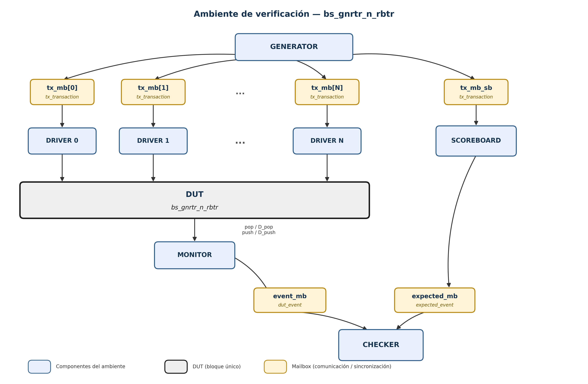

# PLAN DE VERIFICACIÓN

## Bus de datos `bs_gnrtr_n_rbtr`

---

## 1. Objetivo

Verificar funcionalmente el módulo `bs_gnrtr_n_rbtr`, comprobando:

* transmisión y recepción de paquetes;
* direccionamiento unicast;
* broadcast;
* descarte de destinos inválidos;
* serialización y deserialización;
* arbitraje Round Robin;
* manejo de solicitudes pendientes;
* generación correcta de `pop` y `push`;
* integridad de los paquetes;
* operación con diferentes cantidades de interfaces;
* operación con diferentes tamaños de paquete;
* comportamiento con diferentes valores de `broadcast`.

La verificación utilizará un ambiente basado en transacciones y un modelo funcional independiente de la implementación RTL.

---

## 2. Alcance

La configuración base del DUT es:

| Parámetro   | Configuración                  |
| ----------- | ------------------------------ |
| `bits`      | Fijo = 1                       |
| `drvrs`     | Parametrizable                 |
| `pckg_sz`   | Parametrizable, máximo 64 bits |
| `broadcast` | Parametrizable                 |
| Buses       | 1                              |

Las configuraciones principales a verificar son:

```text
drvrs   = 2, 4, 8
pckg_sz = 16, 32, 64
```

El formato del paquete, señales del DUT, direccionamiento y demás restricciones funcionales se encuentran definidos en `DUT_BUS_SPEC.md`.

---

## 3. Arquitectura del ambiente

El ambiente estará compuesto por:

* Test
* Generator
* Drivers
* Monitor
* Checker
* Scoreboard

La comunicación entre componentes utilizará los siguientes paquetes:

| Comunicación           | Paquete          |
| ---------------------- | ---------------- |
| Generator → Driver     | `tx_transaction` |
| Generator → Scoreboard | `tx_transaction` |
| Monitor → Checker      | `dut_event`      |
| Scoreboard → Checker   | `expected_event` |

Los mailboxes se utilizarán para comunicación y sincronización entre procesos concurrentes. El estado del modelo se mantendrá mediante queues dentro del Scoreboard.

### Diagrama de arquitectura

El diagrama muestra los componentes del ambiente, la dirección del flujo y el nombre de la transacción que atraviesa cada mailbox. Los Drivers se representan como múltiples instancias (`DRIVER 0 ... DRIVER N`) conectadas al mismo DUT; este último se muestra como un único bloque, sin exponer FSMs, arbiter, serializer ni señales internas.



*Figura 1. Arquitectura del ambiente de verificación. Generator distribuye `tx_transaction` a cada Driver mediante `tx_mb[i]` y al Scoreboard mediante `tx_mb_sb`; los Drivers se conectan directamente al DUT; el Monitor observa el DUT y envía `dut_event` al Checker mediante `event_mb`; el Scoreboard envía `expected_event` al Checker mediante `expected_mb`.*

El diagrama es conceptual; la cantidad exacta de mailboxes y la implementación de las interfaces se definirán durante la codificación.

---

## 4. Estrategia de verificación

La verificación seguirá un modelo basado en transacciones:

```text
Scenario
   │
   ▼
Generator
   │
   ├──────────────► Drivers ───► DUT
   │
   └──────────────► Scoreboard
                              │
DUT ───► Monitor ───► Checker ◄┘
```

El Generator seleccionará el escenario y generará las transacciones correspondientes.

El Scoreboard mantendrá el modelo funcional y determinará los eventos esperados.

El Monitor observará la actividad del DUT y la convertirá en `dut_event`.

El Checker comparará los eventos observados contra los eventos esperados proporcionados por el Scoreboard.

El modelo no reproducirá la implementación interna del RTL.

---

## 5. Modelo funcional

El Scoreboard mantendrá el estado esperado mediante queues de SystemVerilog:

```text
tx_pending[i]
rx_expected[i]
```

`tx_pending[i]` conservará los paquetes ofrecidos al DUT hasta que `pop[i]` confirme su consumo.

`rx_expected[i]` conservará los paquetes que el modelo espera recibir en cada interfaz.

Para cada transmisión:

```text
tx_transaction
       │
       ▼
 determinar destino
       │
       ├── unicast   → rx_expected[destino]
       │
       ├── broadcast → rx_expected[interfaces]
       │
       └── inválido  → ninguna cola
```

Las colas solamente se actualizarán después de confirmar el evento correspondiente.

`push` y `pop` se procesarán como eventos independientes, permitiendo que ambos ocurran simultáneamente.

---

## 6. Generación de estímulos

La generación se realizará por capas:

```text
Scenario
   ↓
Tipo de tráfico
   ↓
Interfaz origen
   ↓
Destino
   ↓
Payload
   ↓
Momento de solicitud
```

Se contemplarán:

* tráfico aislado;
* solicitudes simultáneas;
* tráfico de todas las interfaces;
* tráfico idle;
* transmisiones back-to-back;
* tráfico unicast;
* tráfico broadcast;
* destinos inválidos;
* tráfico mixto.

El payload deberá incluir valores aleatorios y patrones dirigidos como:

```text
0
todos unos
1010...
0101...
```

---

## 7. Funcionalidades a verificar

### 7.1 Transmisión

Verificar que cada interfaz pueda presentar paquetes mediante:

```text
pndng[i]
D_pop[i]
```

y que el DUT confirme su consumo mediante:

```text
pop[i]
```

### 7.2 Recepción

Verificar que los paquetes recibidos sean presentados mediante:

```text
D_push[i]
push[i]
```

y correspondan con los eventos esperados.

### 7.3 Direccionamiento

Verificar:

* unicast a cada interfaz;
* broadcast;
* destinos inválidos;
* primer y último ID válido;
* primer ID inválido.

### 7.4 Arbitraje

Verificar funcionalmente el Round Robin mediante escenarios con múltiples interfaces solicitando simultáneamente el bus.

Debe comprobarse que:

* no exista transmisión simultánea sobre el bus;
* las solicitudes pendientes sean atendidas;
* el acceso siga el comportamiento Round Robin esperado.

Las señales internas de arbitraje se utilizarán únicamente como apoyo de diagnóstico.

### 7.5 Serialización

Verificar la integridad del paquete desde `D_pop` hasta la recepción correspondiente en `D_push`.

La comparación se realizará a nivel de transacción, sin reproducir la implementación interna del serializer.

### 7.6 Operaciones simultáneas

Verificar independientemente los casos donde:

```text
pop[i]  = 1
push[i] = 1
```

ocurran en el mismo ciclo.

---

## 8. Casos de prueba

| ID   | Prueba                     | Objetivo principal                                         |
| ---- | -------------------------- | ---------------------------------------------------------- |
| TP01 | Reset                      | Verificar estado inicial y recuperación a operación normal |
| TP02 | Transmisión                | Transmitir desde cada interfaz y verificar `pop`           |
| TP03 | Unicast                    | Verificar recepción únicamente en el destino                |
| TP04 | Broadcast                  | Verificar recepción en todas las interfaces                |
| TP05 | Dirección inválida         | Verificar ausencia de recepción                             |
| TP06 | Broadcast consecutivo      | Verificar múltiples broadcasts y conservación del orden     |
| TP07 | Contención                 | Verificar Round Robin con dos interfaces                    |
| TP08 | Todos activos              | Verificar Round Robin con todas las interfaces              |
| TP09 | Idle                       | Verificar ausencia de actividad espuria                     |
| TP10 | Back-to-back               | Verificar transmisiones consecutivas                        |
| TP11 | Tráfico mixto              | Combinar unicast, broadcast e inválidos                     |
| TP12 | Integridad de datos        | Verificar patrones y extremos del payload                   |
| TP13 | `push` + `pop`             | Verificar operaciones simultáneas                           |
| TP14 | `pckg_sz`                  | Verificar 16, 32 y 64 bits                                  |
| TP15 | `drvrs`                    | Verificar 2, 4 y 8 interfaces                                |
| TP16 | `broadcast` parametrizable | Verificar diferentes direcciones de broadcast                |

---

### 9. Casos de esquina

Se verificarán condiciones límite y situaciones potencialmente conflictivas, incluyendo:

* Reset durante actividad.
* Ausencia de tráfico.
* Una sola interfaz activa.
* Todas las interfaces activas simultáneamente.
* Solicitudes simultáneas y cambios de prioridad.
* Transmisiones consecutivas sin tiempo de espera.
* `pop` y `push` simultáneos.
* Destino inválido o fuera del rango de interfaces.
* Broadcast con todas las interfaces disponibles.
* Paquetes con payload en valores límite.
* Valores mínimos y máximos de `pckg_sz`.
* Valores mínimos y máximos de `drvrs`.
* Cambios de tráfico entre unicast, broadcast e inválido.
* Múltiples paquetes pendientes durante la arbitraje Round Robin.
* Posibles condiciones de pérdida, duplicación o desorden de paquetes.

---

## 10. Matriz de cobertura del plan

| Funcionalidad              | Pruebas          |
| --------------------------- | ---------------- |
| Reset                       | TP01             |
| Transmisión                 | TP02, TP10       |
| Unicast                     | TP03, TP11       |
| Broadcast                   | TP04, TP06, TP11 |
| Dirección inválida          | TP05, TP11       |
| Round Robin                 | TP07, TP08       |
| Idle                        | TP09             |
| Integridad de datos         | TP12, TP14       |
| `push` / `pop` simultáneos  | TP13             |
| `pckg_sz`                   | TP14             |
| `drvrs`                     | TP15             |
| `broadcast`                 | TP16             |

Esta matriz representa cobertura de escenarios de prueba y no functional coverage de SystemVerilog.

---

## 11. Criterios de verificación

Una prueba será considerada exitosa cuando:

* los paquetes consumidos mediante `pop` correspondan a los paquetes ofrecidos;
* los paquetes recibidos mediante `push` correspondan a los esperados;
* el direccionamiento sea correcto;
* los destinos inválidos no generen recepciones;
* los broadcasts sean recibidos por las interfaces correspondientes;
* no exista transmisión simultánea sobre el bus;
* el comportamiento Round Robin sea correcto;
* no existan pérdidas ni duplicaciones de paquetes;
* se preserve el orden esperado;
* la integridad del paquete se mantenga durante la transmisión y recepción;
* las configuraciones parametrizadas funcionen correctamente.

---


